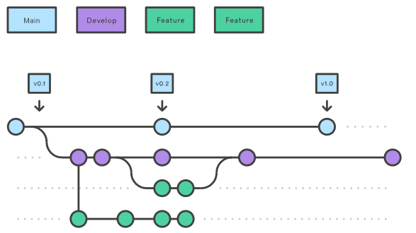
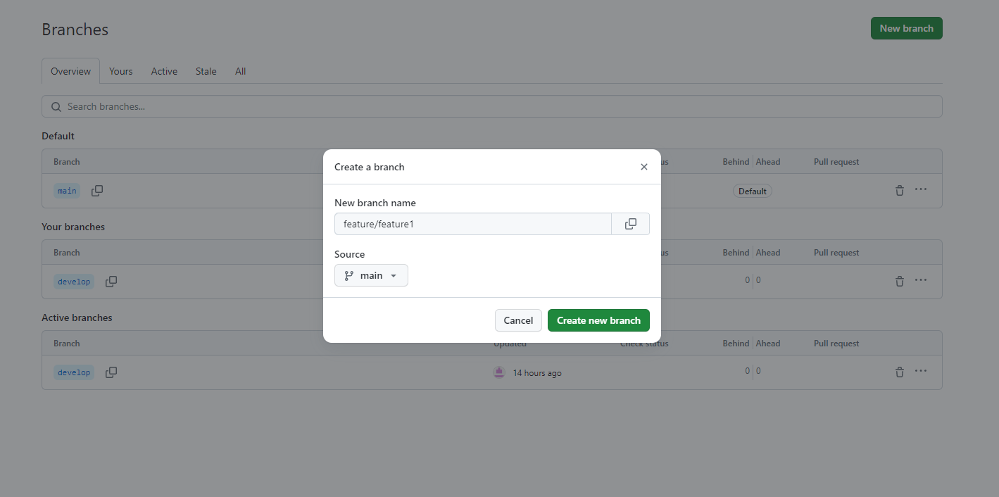

# Gitflow workflow instruktioner


## Riktlinjer
- Arbeta på feature branches och merga sedan till develop när featuren är klar.
- Utför väl utförda tester och se till så att koden är väl fungerande innan develop branchen mergas med main branchen.
- Alla feautres ska ha namn konventionen *feature/feature_name* för att hålla struktur. 
- Försök hålla alla branches remote på Github så vi får en bättre överblick.

## Skapa feature branch

Alla feautres ska ha namn konventionen *feature/feature_name* för att hålla struktur. 

### Via GitHub
Skapa ny branch under *branches->New Branch*.


### Via terminalen
```
git branch feature/feature_name
```
```
git switch feature/feature_name
```
*Arbeta på en feature and sedan använd följande kommandon.*
```
git add .
```
```
git commit -m “message”
```
```
git push -–set-upstream origin feature/feature1
```

## Merge feature branch to develop

### Via terminalen
När du arbetat klart på din feature, utfört add och commit. Kör följande kommandon.
```
git checkout develop
```
```
git merge feature/feature_name
```

## Merge develop branch to main

När develop är färdigutvecklad och väl utförda tester har gjorts kan en merge till main utföras.
### Via terminalen
```
git checkout main
```
```
git merge develop
```